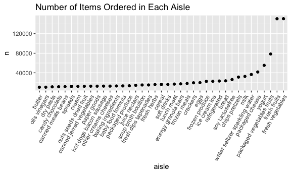
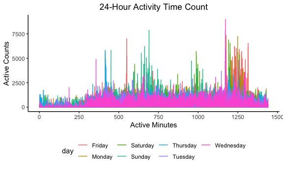
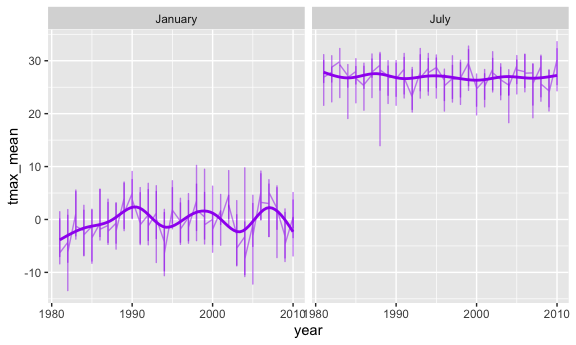
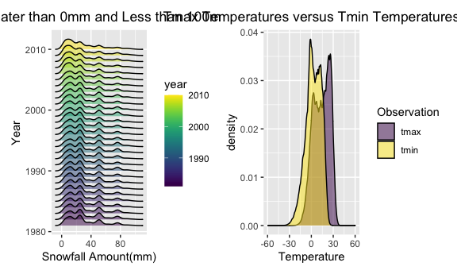

p8105_hw3_ma4197
================
Mayuri Albal
2022-10-15

\##Set-Up:

``` r
library(tidyverse)
```

    ## ── Attaching packages ─────────────────────────────────────── tidyverse 1.3.2 ──
    ## ✔ ggplot2 3.3.6      ✔ purrr   0.3.4 
    ## ✔ tibble  3.1.8      ✔ dplyr   1.0.10
    ## ✔ tidyr   1.2.0      ✔ stringr 1.4.1 
    ## ✔ readr   2.1.2      ✔ forcats 0.5.2 
    ## ── Conflicts ────────────────────────────────────────── tidyverse_conflicts() ──
    ## ✖ dplyr::filter() masks stats::filter()
    ## ✖ dplyr::lag()    masks stats::lag()

``` r
library(ggplot2)
library(readxl)
library("scales")
```

    ## 
    ## Attaching package: 'scales'
    ## 
    ## The following object is masked from 'package:purrr':
    ## 
    ##     discard
    ## 
    ## The following object is masked from 'package:readr':
    ## 
    ##     col_factor

``` r
library(patchwork)
library(dplyr)
library(ggridges)
```

\##Problem 1

``` r
library(p8105.datasets)
data("instacart")
```

Preliminary Analysis:

``` r
instacart=
  instacart %>% 
  as_tibble (instacart)
```

Explanation: In this data set ‘instacart’ there are 15 variables and
1,384,617 observations. Each row signifies an item within an individuals
order. For example, an order 1 had ordered, Bulgarian yogurt, Cottage
Cheese, Celery Hearts, Cucumber Kirby, Smoked Sardines, etc. Key
variables in this data set are: “order_id”, “product_id”,
“add_to_cart_order”, “reordered”, “user_id”,“eval_set”, “order_number”,
“order_hour_of_day”, “days_since_prior_order”, “product_name”,
“aisle_id”, “department_id”, “aisle”, and “department”.

Aisle Count:

``` r
instacart %>% 
  group_by(aisle_id) %>% 
  summarize(n_obs= n()) %>% 
  arrange(desc(n_obs))
```

    ## # A tibble: 134 × 2
    ##    aisle_id  n_obs
    ##       <int>  <int>
    ##  1       83 150609
    ##  2       24 150473
    ##  3      123  78493
    ##  4      120  55240
    ##  5       21  41699
    ##  6      115  36617
    ##  7       84  32644
    ##  8      107  31269
    ##  9       91  26240
    ## 10      112  23635
    ## # … with 124 more rows

Explanation: There are 134 aisles, Aisles 83 (obs= 150,609) and 24 (obs=
150,473) were ordered from the most.

Plot of Number of Items Ordered in Each Aisle:

``` r
instacart %>% 
  count(aisle) %>% 
filter(n > 10000) %>% 
  mutate(aisle= fct_reorder(aisle, n)) %>% 
  ggplot (aes(x=aisle, y=n))+
  geom_point()+
  labs(title= "Number of Items Ordered in Each Aisle")+
  theme(axis.text.x= element_text (angle=60, hjust=1))
```


Top Three Most Popular Items:

``` r
instacart %>% 
  filter(aisle %in% c("baking ingredients", "dog food care", "packaged vegetables fruits")) %>% 
  group_by(aisle) %>% 
  count(product_name) %>% 
  mutate (rank= min_rank (desc(n))) %>% 
  filter(rank < 4) %>% 
  arrange (desc(n))
```

    ## # A tibble: 9 × 4
    ## # Groups:   aisle [3]
    ##   aisle                      product_name                                n  rank
    ##   <chr>                      <chr>                                   <int> <int>
    ## 1 packaged vegetables fruits Organic Baby Spinach                     9784     1
    ## 2 packaged vegetables fruits Organic Raspberries                      5546     2
    ## 3 packaged vegetables fruits Organic Blueberries                      4966     3
    ## 4 baking ingredients         Light Brown Sugar                         499     1
    ## 5 baking ingredients         Pure Baking Soda                          387     2
    ## 6 baking ingredients         Cane Sugar                                336     3
    ## 7 dog food care              Snack Sticks Chicken & Rice Recipe Dog…    30     1
    ## 8 dog food care              Organix Chicken & Brown Rice Recipe        28     2
    ## 9 dog food care              Small Dog Biscuits                         26     3

Mean Hour of Day for Ordering of ‘Pink Lady Apple’ and ‘Coffee Ice
Cream’:

``` r
instacart %>% 
  filter(product_name %in% c("Pink Lady Apples", "Coffee Ice Cream")) %>% 
  group_by(product_name, order_dow) %>% 
  summarize (mean_hour = mean (order_hour_of_day)) %>% 
  spread(key = order_dow, value = mean_hour) 
```

    ## `summarise()` has grouped output by 'product_name'. You can override using the
    ## `.groups` argument.

    ## # A tibble: 2 × 8
    ## # Groups:   product_name [2]
    ##   product_name       `0`   `1`   `2`   `3`   `4`   `5`   `6`
    ##   <chr>            <dbl> <dbl> <dbl> <dbl> <dbl> <dbl> <dbl>
    ## 1 Coffee Ice Cream  13.8  14.3  15.4  15.3  15.2  12.3  13.8
    ## 2 Pink Lady Apples  13.4  11.4  11.7  14.2  11.6  12.8  11.9

\##Problem 2

Data Cleaning:

``` r
accel_data = read_csv(file= "./data/accel_data.csv") %>%
janitor::clean_names() %>%
  mutate(
    wkd_wkn= ifelse(day %in% c('Sunday', 'Saturday'), 'weekend', 'weekday')) %>% 
  relocate(week,day_id,day,wkd_wkn) %>%
  pivot_longer(
    activity_1:activity_1440,
    names_to = "active_num",
    names_prefix = "activity_",
    names_transform=list(active_num= as.numeric),
    values_to = "active_counts")
```

    ## Rows: 35 Columns: 1443
    ## ── Column specification ────────────────────────────────────────────────────────
    ## Delimiter: ","
    ## chr    (1): day
    ## dbl (1442): week, day_id, activity.1, activity.2, activity.3, activity.4, ac...
    ## 
    ## ℹ Use `spec()` to retrieve the full column specification for this data.
    ## ℹ Specify the column types or set `show_col_types = FALSE` to quiet this message.

``` r
view(accel_data)
skimr::skim(accel_data)
```

|                                                  |            |
|:-------------------------------------------------|:-----------|
| Name                                             | accel_data |
| Number of rows                                   | 50400      |
| Number of columns                                | 6          |
| \_\_\_\_\_\_\_\_\_\_\_\_\_\_\_\_\_\_\_\_\_\_\_   |            |
| Column type frequency:                           |            |
| character                                        | 2          |
| numeric                                          | 4          |
| \_\_\_\_\_\_\_\_\_\_\_\_\_\_\_\_\_\_\_\_\_\_\_\_ |            |
| Group variables                                  | None       |

Data summary

**Variable type: character**

| skim_variable | n_missing | complete_rate | min | max | empty | n_unique | whitespace |
|:--------------|----------:|--------------:|----:|----:|------:|---------:|-----------:|
| day           |         0 |             1 |   6 |   9 |     0 |        7 |          0 |
| wkd_wkn       |         0 |             1 |   7 |   7 |     0 |        2 |          0 |

**Variable type: numeric**

| skim_variable | n_missing | complete_rate |   mean |     sd |  p0 |    p25 |   p50 |     p75 | p100 | hist  |
|:--------------|----------:|--------------:|-------:|-------:|----:|-------:|------:|--------:|-----:|:------|
| week          |         0 |             1 |   3.00 |   1.41 |   1 |   2.00 |   3.0 |    4.00 |    5 | ▇▇▇▇▇ |
| day_id        |         0 |             1 |  18.00 |  10.10 |   1 |   9.00 |  18.0 |   27.00 |   35 | ▇▇▇▇▇ |
| active_num    |         0 |             1 | 720.50 | 415.70 |   1 | 360.75 | 720.5 | 1080.25 | 1440 | ▇▇▇▇▇ |
| active_counts |         0 |             1 | 267.04 | 443.16 |   1 |   1.00 |  74.0 |  364.00 | 8982 | ▇▁▁▁▁ |

In this cleaned data set of ‘accel_data’ there are 6 variables: “week”,
“day_id”, “day”, “wkd_wkn”, “active_num”, “active_count”. “Active_num”
and “active_count” were generated from the previously displayed data for
each activity that would occur (1-1440) and the corresponding count
value the accelerometer measured. There are 50,400 observations within
this new data set.

Aggregated Data:

``` r
accel_data %>% 
  group_by(day_id) %>% 
  mutate(
    tot_active= sum(active_counts)) %>% 
  summarize(day_id, tot_active) %>% 
  distinct %>% 
  print (n=)
```

    ## `summarise()` has grouped output by 'day_id'. You can override using the
    ## `.groups` argument.

    ## # A tibble: 35 × 2
    ## # Groups:   day_id [35]
    ##    day_id tot_active
    ##     <dbl>      <dbl>
    ##  1      1    480543.
    ##  2      2     78828.
    ##  3      3    376254 
    ##  4      4    631105 
    ##  5      5    355924.
    ##  6      6    307094.
    ##  7      7    340115.
    ##  8      8    568839 
    ##  9      9    295431 
    ## 10     10    607175 
    ## # … with 25 more rows

Explanation: Based on the printed table above, there are 35 days
included in the data set. When observing the total activity counts
(“tot_active”) across the 35 days, there does not appear to be an
definable trend in the total activity of the individual. However, there
are dips in total activity count on days 24 and 31.

Plot:

``` r
ggplot(accel_data, aes(x= active_num, y= active_counts, color=day)) +
  geom_line(aes(group= day, color=day))+
  theme_classic()+ 
  theme(legend.position= "bottom")+
  ggtitle("24-Hour Activity Time Count")+
  theme(plot.title = element_text(hjust= 0.5))+
    labs(x = "Active Minutes",
        y= "Active Counts") +
  scale_x_continuous(breaks= c(0, 250, 500, 750, 1000, 1250, 1500))
```



``` r
   scale_colour_brewer(type = "seq", palette = "Spectral")
```

    ## <ggproto object: Class ScaleDiscrete, Scale, gg>
    ##     aesthetics: colour
    ##     axis_order: function
    ##     break_info: function
    ##     break_positions: function
    ##     breaks: waiver
    ##     call: call
    ##     clone: function
    ##     dimension: function
    ##     drop: TRUE
    ##     expand: waiver
    ##     get_breaks: function
    ##     get_breaks_minor: function
    ##     get_labels: function
    ##     get_limits: function
    ##     guide: legend
    ##     is_discrete: function
    ##     is_empty: function
    ##     labels: waiver
    ##     limits: NULL
    ##     make_sec_title: function
    ##     make_title: function
    ##     map: function
    ##     map_df: function
    ##     n.breaks.cache: NULL
    ##     na.translate: TRUE
    ##     na.value: NA
    ##     name: waiver
    ##     palette: function
    ##     palette.cache: NULL
    ##     position: left
    ##     range: <ggproto object: Class RangeDiscrete, Range, gg>
    ##         range: NULL
    ##         reset: function
    ##         train: function
    ##         super:  <ggproto object: Class RangeDiscrete, Range, gg>
    ##     rescale: function
    ##     reset: function
    ##     scale_name: brewer
    ##     train: function
    ##     train_df: function
    ##     transform: function
    ##     transform_df: function
    ##     super:  <ggproto object: Class ScaleDiscrete, Scale, gg>

Explanation: Based upon this graph, there appears to peaks in active
counts being measured from the accelerometer on Saturday and Sunday for
this participant. Additionally, it appears that during 1250 minutes
throughout all of the days, there is a peak in active minutes around
7500 active counts. However for Saturday and Sunday, this peak is
observed earlier in the data during the 500 to 750 minutes as well as
1000 minutes.

\##Problem 3

``` r
library(p8105.datasets)
data("ny_noaa")
```

Description: In the “ny_noaa” there are 7 variables and 2,595,176
observations. This data looks at the 5 key variables that all New York
weather stations assess, from January 1, 1981, to December 31st, 2010.
Key variables include:‘id’, ‘date’, ‘prcp’, ‘snow’, ‘snwd’, ‘tmax’ and
‘tmin’. In this data set, a significant portion of the data is missing
from some of the variables. For prcp, about 145,838 observations are
missing, with approximately 94.38% of the data having observations for
the variable. For snow and snwd, approximately 85.31% and 77.19% of the
data have observations for those variables. However for both tmax and
tmin only 56.29% of the data have observation values for these
variables, indicating that overall the missing data may bias the
analysis due to the portion missing/labeled NA.

Part 1- Data Cleaning:

``` r
ny_noaa_3 =
ny_noaa %>% 
  janitor::clean_names() %>% 
  separate(date, c("year", "month", "day"), sep = "-") %>%
  mutate(
    year= as.numeric(year),
    month= as.numeric(month),
    day=as.numeric(day),
   tmin= as.numeric(tmin),
   tmax= as.numeric(tmax),
   snow= as.numeric(snow),
    tmin= tmin/10,
    tmax = tmax/10,
    prcp = prcp/10
  )
skimr::skim(ny_noaa)
```

|                                                  |         |
|:-------------------------------------------------|:--------|
| Name                                             | ny_noaa |
| Number of rows                                   | 2595176 |
| Number of columns                                | 7       |
| \_\_\_\_\_\_\_\_\_\_\_\_\_\_\_\_\_\_\_\_\_\_\_   |         |
| Column type frequency:                           |         |
| character                                        | 3       |
| Date                                             | 1       |
| numeric                                          | 3       |
| \_\_\_\_\_\_\_\_\_\_\_\_\_\_\_\_\_\_\_\_\_\_\_\_ |         |
| Group variables                                  | None    |

Data summary

**Variable type: character**

| skim_variable | n_missing | complete_rate | min | max | empty | n_unique | whitespace |
|:--------------|----------:|--------------:|----:|----:|------:|---------:|-----------:|
| id            |         0 |          1.00 |  11 |  11 |     0 |      747 |          0 |
| tmax          |   1134358 |          0.56 |   1 |   4 |     0 |      532 |          0 |
| tmin          |   1134420 |          0.56 |   1 |   4 |     0 |      548 |          0 |

**Variable type: Date**

| skim_variable | n_missing | complete_rate | min        | max        | median     | n_unique |
|:--------------|----------:|--------------:|:-----------|:-----------|:-----------|---------:|
| date          |         0 |             1 | 1981-01-01 | 2010-12-31 | 1997-01-21 |    10957 |

**Variable type: numeric**

| skim_variable | n_missing | complete_rate |  mean |     sd |  p0 | p25 | p50 | p75 |  p100 | hist  |
|:--------------|----------:|--------------:|------:|-------:|----:|----:|----:|----:|------:|:------|
| prcp          |    145838 |          0.94 | 29.82 |  78.18 |   0 |   0 |   0 |  23 | 22860 | ▇▁▁▁▁ |
| snow          |    381221 |          0.85 |  4.99 |  27.22 | -13 |   0 |   0 |   0 | 10160 | ▇▁▁▁▁ |
| snwd          |    591786 |          0.77 | 37.31 | 113.54 |   0 |   0 |   0 |   0 |  9195 | ▇▁▁▁▁ |

Snow Count:

``` r
count(ny_noaa_3, snow) 
```

    ## # A tibble: 282 × 2
    ##     snow       n
    ##    <dbl>   <int>
    ##  1   -13       1
    ##  2     0 2008508
    ##  3     3    8790
    ##  4     5    9748
    ##  5     8    9962
    ##  6    10    5106
    ##  7    13   23095
    ##  8    15    3672
    ##  9    18    3226
    ## 10    20    4797
    ## # … with 272 more rows

Explanation: From the original data set ‘ny_noaa’, which had 7 variables
and 2,595176 observations, a new data set was formed called ‘ny_noaa_3’
with 9 variables and 2,595,176 observations. In this new data set, the
variables are: ‘id’, ‘year’, ‘month’, ‘day’, ‘prcp’, ‘snow’, ‘snwd’,
‘tmax’, and ‘tmin’. The variables ‘year’, ‘month’, and ‘day’ were formed
from the variable ‘date’ in the original data set. The variables ‘prcp’,
‘tmin’, and ‘tmax’ were divided by 10 due to their original units being
a tenth of a mm or Celsius, while the other variables were not, thus was
done to ensure reasonable units.

When observing the variable snowfall, the most commonly observed values
were 0mm of snowfall and NA. This signifies that many days between
January 1981 and December 2010 did not have snowfall in New York, which
can be corroborated due to snowfall being only during winter months and
under specific conditions, thus more likely to have more dates reporting
NA or 0 mm of snowfall.

Plot:

``` r
jj_tmax=
ny_noaa_3 %>% 
  filter(month %in% c("1", "7")) %>% 
  mutate(month= recode(month, 
                 "1"= "January",
                 "7"= "July")) %>% 
  drop_na(tmax) %>% 
  group_by(year, month, id) %>% 
  summarize(
    tmax_mean= mean(tmax), .groups= "drop")

ggplot(data= jj_tmax,aes(x= year, y= tmax_mean, color=month))+
  geom_line(alpha=0.5, color= "purple")+
  geom_smooth(alpha=0.5, se= FALSE, color= "purple")+
facet_grid(.~month)
```

    ## `geom_smooth()` using method = 'gam' and formula 'y ~ s(x, bs = "cs")'



Description: From these plots, it appears that in the month of January
the tmax temperature was often around 0 degrees Celsius, with a few
outliers below -10 degrees Celsius. For the month of July, it appears
that the tmax temperature was often around 27 degrees Celsius, with one
outlier being about 15 degrees Celsius as the tmax for the month of
July.

\###Part 2

tmin vs.tmax Data:

``` r
tmax_tmin_comp=
  ny_noaa_3 %>% 
  drop_na(tmax,tmin) %>% 
  select(tmax, tmin) %>% 
  pivot_longer(
    tmax:tmin,
    names_to = "Observation",
    values_to = "Temp"
  ) %>% 
 ggplot(aes(x = Temp, fill = Observation)) +
  geom_density(alpha = .5) + 
  viridis::scale_fill_viridis(discrete = TRUE)
```

Snowfall Data:

``` r
snowfall_amount =
  ny_noaa_3 %>% 
  filter(0 < snow, snow < 100) %>% 
  group_by(year) %>% 
  ggplot(aes(x=snow, y=year,group=year,fill=year))+
  geom_density_ridges()
```

Patchwork:

``` r
tmax_tmin_comp=
  ny_noaa_3 %>% 
  drop_na(tmax,tmin) %>% 
  select(tmax, tmin) %>% 
  pivot_longer(
    tmax:tmin,
    names_to = "Observation",
    values_to = "Temp"
  ) %>% 
 ggplot(aes(x = Temp, fill = Observation)) +
  geom_density(alpha = .5) + 
  labs(
    title= "Tmax Temperatures versus Tmin Temperatures",
    x= "Temperature")+
  theme(plot.title = element_text(hjust= 0.5))+
  viridis::scale_fill_viridis(discrete = TRUE)

snowfall_amount =
  ny_noaa_3 %>% 
  filter(0 < snow, snow < 100) %>% 
  group_by(year) %>% 
  ggplot(aes(x=snow, y=year,group=year,fill=year))+
  geom_density_ridges(alpha=0.5)+
  labs(
    title= "Distribution of Snowfall Greater than 0mm and Less than 100mm By Year (1981-2010)",
    x= "Snowfall Amount(mm)",
    y= "Year")+ 
  theme(plot.title = element_text(hjust= 0.5))+
  viridis::scale_fill_viridis(discrete = FALSE)
  
(snowfall_amount+tmax_tmin_comp)
```

    ## Picking joint bandwidth of 3.76


